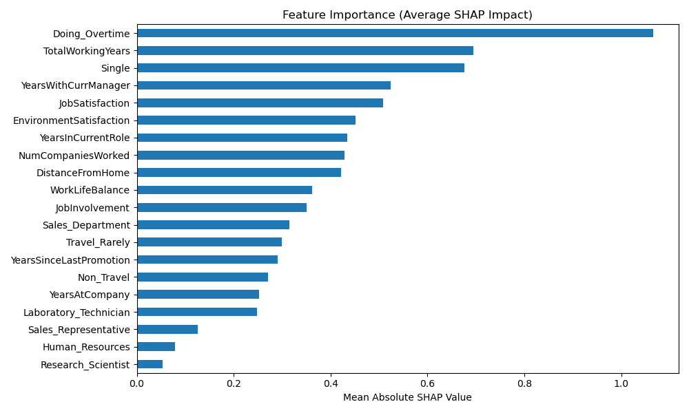

# 📊 Employee Retention Risk Prediction


[](https://nbviewer.org/github/SonnyBD/employee-retention-risk/blob/main/notebooks/Full_Retention_Model_Walkthrough.ipynb)

A machine learning–driven People Analytics project that identifies employees at risk of leaving and explains the drivers behind attrition. Built to support HR teams in making proactive, data-informed retention decisions.


---

## 🧠 Objective

To build a calibrated, interpretable predictive model using HR data that estimates employee attrition risk, uncovers key retention factors, and segments employees into actionable risk tiers for HR intervention.

---

## 🛠️ Tools & Techniques

- Python (pandas, scikit-learn, imbalanced-learn, SHAP)
- XGBoost Classifier + Recursive Feature Elimination (RFE)
- SMOTE for class balancing
- Probability calibration (Platt scaling)
- SHAP for model explainability
- Matplotlib for visualizations

---

## 🔄 Workflow Summary

1. Data cleaning and feature engineering  
2. Class balancing using SMOTE  
3. Feature selection with RFE  
4. XGBoost model tuning and probability calibration  
5. Risk scoring and percentile-based tiering (Low, Moderate, High)  
6. SHAP-based interpretation of feature importance  
7. Final outputs: Excel reports, risk segmentation, and SHAP visualizations

---

## 📈 Key Results

- ✅ **88% model accuracy**
- 🎯 **Improved recall** for identifying leavers (minimized false negatives)
- 🔍 **Top predictors**: Overtime, Promotion Rate, Job Satisfaction, Environment Satisfaction
- ⚠️ **10% of employees flagged as high risk** using calibrated thresholds

---

## 📆 Why This Matters

- 📉 Replacing a lost employee can cost ~33% of their annual salary
- ⏱️ Manual retention tracking is inefficient and reactive
- 🧠 This model helps HR prioritize who to retain and why — with explainability

> Empower HR teams with data-backed decisions instead of gut-feeling.

---

## 📃 Example Output

```
Output directory: ./outputs
Engineering features...
After correlation filtering: 44 features
Best parameters: {'learning_rate': 0.1, ...}
Best threshold: 0.20, F1: 0.45
Employee 1 top risk factors:
  JobSatisfaction     -1.24
  Doing_Overtime      -0.89
  Single               1.03
```



---

## 📂 Repository Structure

```
employee-retention-risk/
│
├── data/                           # Raw and preprocessed input data
│   ├── IBM_Test_Project_Preprocessed_Data.xlsx
│   └── WA_Fn-UseC_-HR-Employee-Attrition.csv
│
├── notebooks/                      # Jupyter notebook walkthrough
│   └── Full_Retention_Model_Walkthrough_UPDATED.ipynb
│
├── outputs/                        # Final visualizations & export files
│   ├── Retention_Risk_Analysis_Output.xlsx
│   └── Risk_Distribution_PieChart.png
│
├── src/                            # Modular machine learning pipeline
│   └── retention_pipeline.py
│
├── .gitignore                      # Files to exclude from version control
├── LICENSE                         # MIT open-source license
├── README.md                       # Project overview and results
└── requirements.txt                # Python environment dependencies
```

---

## 🚀 How to Run This Project

```bash
# 1. Clone the repository
git clone https://github.com/SonnyBD/employee-retention-risk.git
cd employee-retention-risk

# 2. Install dependencies
pip install -r requirements.txt

# 3. Run the pipeline script
python src/retention_pipeline.py

# 4. Launch the notebook for a full walkthrough
jupyter notebook notebooks/Full_Retention_Model_Walkthrough_UPDATED.ipynb
```

---

## 📁 Dataset

This project uses the [IBM HR Analytics Employee Attrition dataset](https://www.kaggle.com/datasets/pavansubhasht/ibm-hr-analytics-attrition-dataset) from Kaggle, with additional preprocessing and feature engineering.

---

## 🤝 Contributing

Pull requests are welcome! For major changes, please open an issue first.

To contribute:
```bash
1. Fork this repository
2. Clone your fork
3. Create a feature branch and commit changes
4. Push and submit a PR
```

---

## 📜 License

This project is licensed under the MIT License — open for use with attribution.

---

## 👤 Author

Built by [Sonny Bigras-Dewan](https://www.linkedin.com/in/sonny-bigras-dewan/) — let’s connect!

