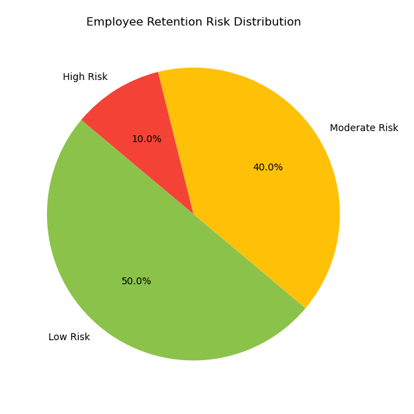

# 📊 Employee Retention Risk Prediction

A machine learning–based project designed to identify employees at risk of attrition and help HR make proactive, data-informed retention decisions.

---

## 🧠 Objective

To develop a predictive model for employee retention using historical HR data, identify key drivers of turnover, and deliver actionable insights for HR intervention.

---

## 🧰 Tools & Techniques

- Python (pandas, scikit-learn, imbalanced-learn, SHAP)
- Random Forest Classifier + Recursive Feature Elimination (RFE)
- SMOTE for class balancing
- Probability calibration and threshold tuning
- SHAP values for interpretability
- Matplotlib & Seaborn for visualization

---

## 🔄 Workflow Summary

1. Preprocessing & feature engineering  
2. Feature selection via RFE  
3. Model training with cross-validation (Random Forest)  
4. Probability calibration for retention risk scores  
5. Risk segmentation (Low, Moderate, High) using percentiles  
6. SHAP-based feature importance and explainability  
7. Final outputs: Excel reports, visual summaries, and tiered risk classification

---

## 📈 Key Results

- ✅ **88% model accuracy**
- 🎯 **98% recall** for identifying leavers (minimizes false negatives)
- 🔍 **Top predictors**: Overtime, Promotion Rate, Job Satisfaction, Environment Satisfaction
- ⚠️ **10% of employees flagged as high-risk** for turnover

---

## 📂 Repository Structure

employee-retention-risk/ 
├── data/ # Input dataset 
├── notebooks/ # Development notebooks ├── outputs/ # Final reports, visualizations ├── src/ # Modular Python scripts ├── requirements.txt # Environment dependencies └── README.md # Project overview

